- [1. Overview of the Project](#1-overview-of-the-project)
- [2. Architectural Diagram](#2-architectural-diagram)
      - [Figure 1: Architectured of the Solution.](#figure-1-architectured-of-the-solution)
- [3. Procedure](#3-procedure)
  - [3.1. Step 1: Authentication](#31-step-1-authentication)
      - [Figure 2: Authentication Step](#figure-2-authentication-step)
      - [Figure 3: az ml workspace share output](#figure-3-az-ml-workspace-share-output)
  - [3.2. Step 2: Automated ML Experiment](#32-step-2-automated-ml-experiment)
      - [Figure 4: Uploaded bankmarketing Dataset](#figure-4-uploaded-bankmarketing-dataset)
      - [Figure 5: Finished AutoML experiment](#figure-5-finished-automl-experiment)
      - [Figure 6: Best model delivered by the AutoML experiment](#figure-6-best-model-delivered-by-the-automl-experiment)
  - [3.3. Step 3: Deploy the Best Model Model](#33-step-3-deploy-the-best-model-model)
      - [Figure 7: Best model deployed as endpoint](#figure-7-best-model-deployed-as-endpoint)
  - [3.4. Step 4: Enable logging](#34-step-4-enable-logging)
      - [Figure 8: Application insights is enabled](#figure-8-application-insights-is-enabled)
  - [3.5. Step 5: Swagger Documentation](#35-step-5-swagger-documentation)
      - [Figure 9: Swagger is operating](#figure-9-swagger-is-operating)
  - [3.6. Step 6: Consume Model Endpoint](#36-step-6-consume-model-endpoint)
      - [Figure 10: The model is consumed by using the endpoint.py file.](#figure-10-the-model-is-consumed-by-using-the-endpointpy-file)
  - [3.7. Step 7: Create, Publish, and consume a Pipeline](#37-step-7-create-publish-and-consume-a-pipeline)
      - [Figure 11: List of created pipelines.](#figure-11-list-of-created-pipelines)
      - [Figure 12: Bankmarketing dataset registered.](#figure-12-bankmarketing-dataset-registered)
      - [Figure 13: AutoML Pipeline.](#figure-13-automl-pipeline)
      - [Figure 14: The AutoML Run is finished.](#figure-14-the-automl-run-is-finished)
      - [Figure 15: Pipeline published as endpoint.](#figure-15-pipeline-published-as-endpoint)
- [4. Screencast](#4-screencast)
- [5. Future work](#5-future-work)
# 1. Overview of the Project

This project is about generating an ML model using Azure AutoML, choosing the best model, setting an authentication step, deploying the best model, setting a logging step, consume the model deployed in an endpoint. In the following steps, an architectural diagram, and the different steps used to develop a full ML solution.

The classification goal is to predict if the client will suscibe a term deposit in a portuguese banking institution, and it is related with a direct  marketing campaigns. This is a classication task and its dependent variable is if the client will suscribe (y).

The attribute information is as follows:

Input variables:
- bank client data:
1 - age (numeric)
2 - job : type of job (categorical: 'admin.','blue-collar','entrepreneur','housemaid','management','retired','self-employed','services','student','technician','unemployed','unknown')
3 - marital : marital status (categorical: 'divorced','married','single','unknown'; note: 'divorced' means divorced or widowed)
4 - education (categorical: 'basic.4y','basic.6y','basic.9y','high.school','illiterate','professional.course','university.degree','unknown')
5 - default: has credit in default? (categorical: 'no','yes','unknown')
6 - housing: has housing loan? (categorical: 'no','yes','unknown')
7 - loan: has personal loan? (categorical: 'no','yes','unknown')
- related with the last contact of the current campaign:
8 - contact: contact communication type (categorical: 'cellular','telephone')
9 - month: last contact month of year (categorical: 'jan', 'feb', 'mar', ..., 'nov', 'dec')
10 - day_of_week: last contact day of the week (categorical: 'mon','tue','wed','thu','fri')
11 - duration: last contact duration, in seconds (numeric). Important note: this attribute highly affects the output target (e.g., if duration=0 then y='no'). Yet, the duration is not known before a call is performed. Also, after the end of the call y is obviously known. Thus, this input should only be included for benchmark purposes and should be discarded if the intention is to have a realistic predictive model.
-  other attributes:
12 - campaign: number of contacts performed during this campaign and for this client (numeric, includes last contact)
13 - pdays: number of days that passed by after the client was last contacted from a previous campaign (numeric; 999 means client was not previously contacted)
14 - previous: number of contacts performed before this campaign and for this client (numeric)
15 - poutcome: outcome of the previous marketing campaign (categorical: 'failure','nonexistent','success')
-  social and economic context attributes
16 - emp.var.rate: employment variation rate - quarterly indicator (numeric)
17 - cons.price.idx: consumer price index - monthly indicator (numeric)
18 - cons.conf.idx: consumer confidence index - monthly indicator (numeric)
19 - euribor3m: euribor 3 month rate - daily indicator (numeric)
20 - nr.employed: number of employees - quarterly indicator (numeric)

- Output variable (desired target):
21 - y - has the client subscribed a term deposit? (binary: 'yes','no')

# 2. Architectural Diagram

Next figure shows the arhitectural diagram used by the deployed solution:

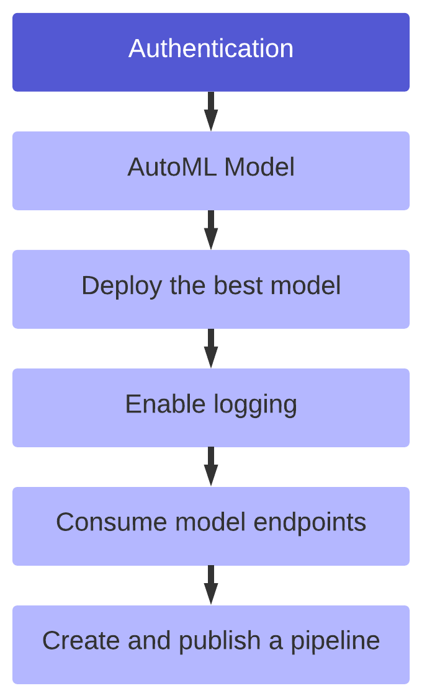
#### Figure 1: Architectured of the Solution.

The architectural diagram starts with the authentication, and this is a crucial step to allows uninterrupted flows. When authentication is no set properly, it requires human interaction, and thus, the flow is interrupted. AutoML is Automated Machine Learning, and this is a tool that helps to focus on the business problem instead of the technical issues like feature engineering, hyperparameter selection, and training and tuning. After selecting the best model trained by the AutoML algorithm, it is time to deploy it. But, it is needed to monitor the model behavior to make sure it is working well, so the logging is enabled to do such a task. The following steps: consume model endpoints and create and publish the pipelines are the last steps by which we interact with the model by passing values and delivering the prediction.

# 3. Procedure

Below are the steps that were followed to develop this project. 

## 3.1. Step 1: Authentication

Because the complete machine learning solution relies on a fully automated CI/CD system, it is needed authentication is configured before the entire pipeline runs. If not configured, the CI/CD will needs human interaction to runs and therefore, the machine learning system is not fully automated.

For this step, it is necessary to install the az cli utility to use the az commands. The next step is to log in by using az login. Then, now the Azure Machine Learning extension is installed with az extension add -n ml -y. After successfully installing the Azure Machine Learning extension, the Service Principal (SP) is created and allowed to access the Azure Machine Learning workspace as shown in the next figure.

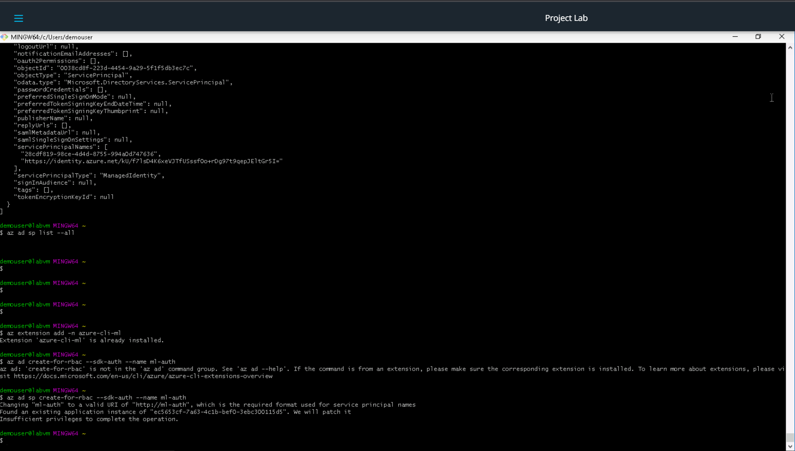
####  Figure 2: Authentication Step

The command az ml workspace share is executed as follows:

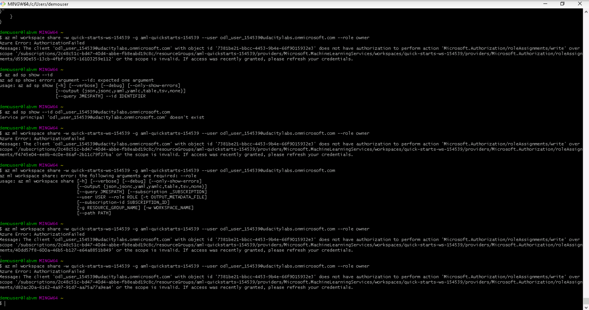
#### Figure 3: az ml workspace share output

## 3.2. Step 2: Automated ML Experiment

The importance of the automated ML is that it can help to focus on the business problem avoiding performing feature engineering, hyperparameter selection, training and, tuning. This allows saving time and money.

After the security is enabled and authentication is completed, an experiment using Automated ML is done. The next figure shows the Bankmarketing dataset uploaded and ready to use.

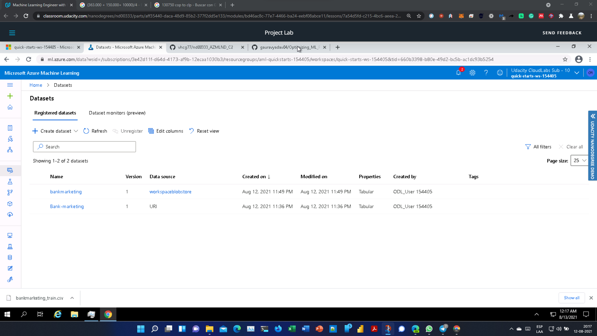
#### Figure 4: Uploaded bankmarketing Dataset

The next figure shows the finished AutoML experiment.

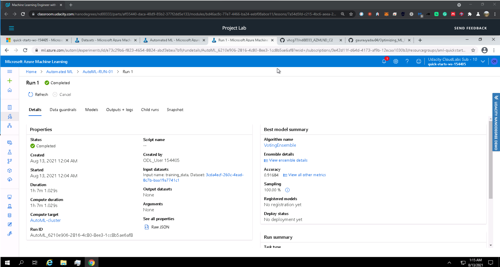
#### Figure 5: Finished AutoML experiment
The next figure shows the best model.

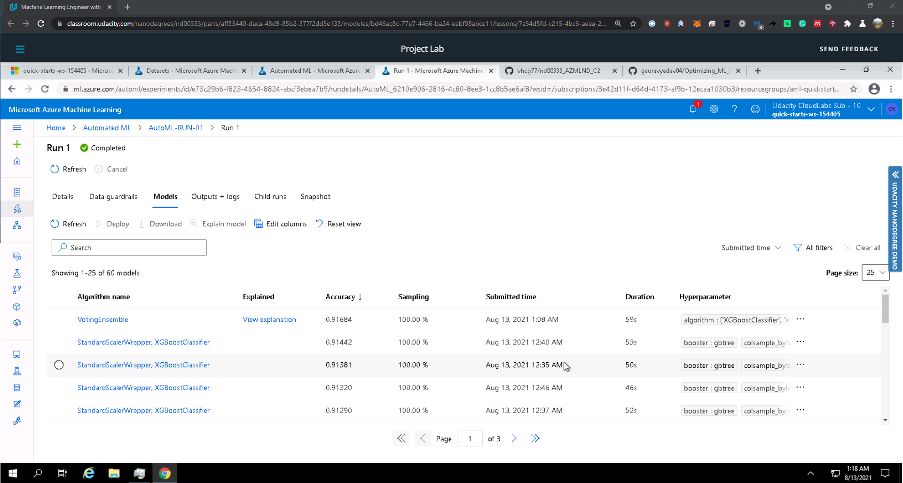
#### Figure 6: Best model delivered by the AutoML experiment

## 3.3. Step 3: Deploy the Best Model Model
The next logical step is to choose the model because the Automated ML delivers not only one if not many models. How do we choose the model? In this case, the best model is according to a selected metric. For this problem, this will be the accuracy metric.

When the experiments are finished, the best model selected, the model is deployed over an endpoint.

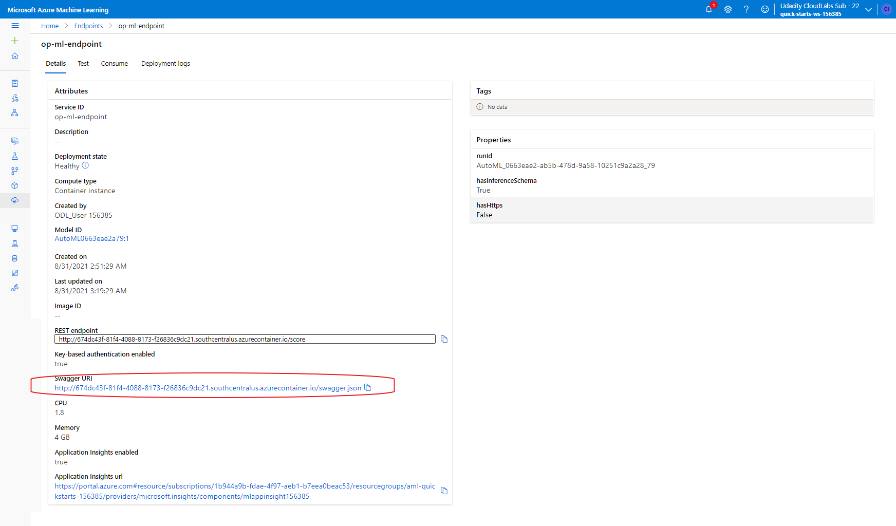
#### Figure 7: Best model deployed as endpoint

## 3.4. Step 4: Enable logging

Logging is a core pillar of Operations in DevOps. Logging allows discovering irregularities in services and most problems in general. It provides information about how the service is behaving. Logging delivers performance anomalies detection, analytic tools.

The Application Insights is enabled during the logging to get more info. The Application Insights is activated by code. The following pictures show the Applications Insights activated and the logs delivered during its execution.

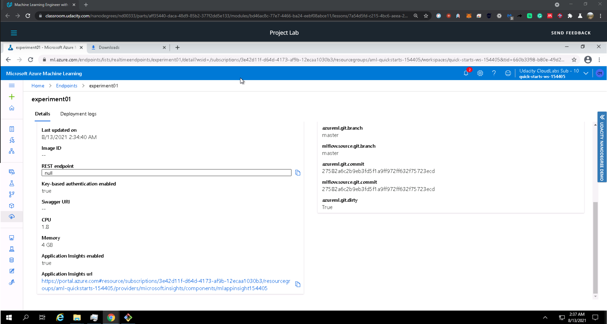
#### Figure 8: Application insights is enabled

## 3.5. Step 5: Swagger Documentation

We expect to consume the machine learning solution output with Swagger. It is a tool that helps build, document, and consume RESTful web.

As part of the exercises, the model is consumed using swagger. For this step, Azure provides a Swagger JSON file, which points to the deployed models. Next figure shows swagger running on localhost showing the HTTP API methods and responses for the model.

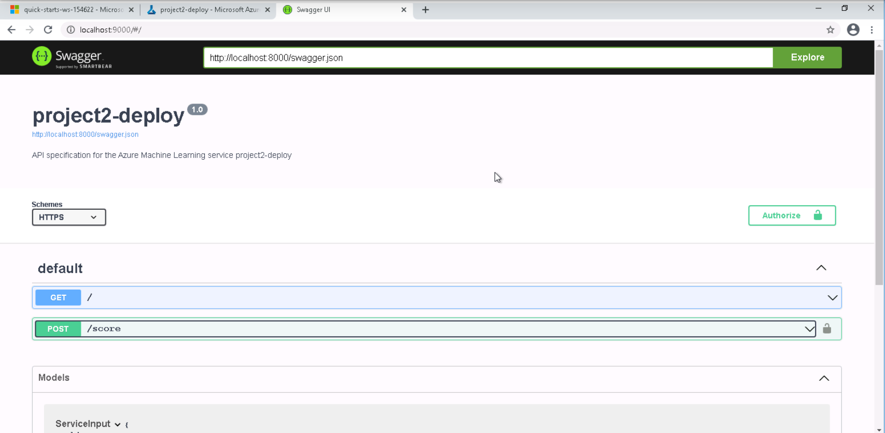
#### Figure 9: Swagger is operating
## 3.6. Step 6: Consume Model Endpoint

There are many ways a machine model is consumed: using inside the developed by which we verify the performance of this model using predefined metrics, by using an alternative code to be consumed as part of an automation process, by using a Web service in order to be used by third web pages.

A script named endpoint.py is used to interact with the trained model. Next figure shows the endpoint.py file running against the API producing a JSON output from the model.

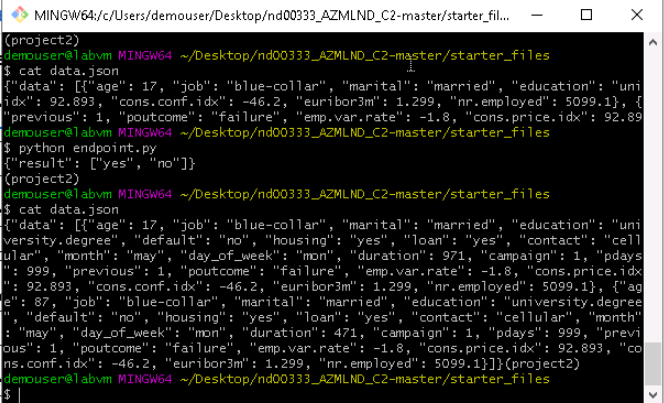
#### Figure 10: The model is consumed by using the endpoint.py file.

## 3.7. Step 7: Create, Publish, and consume a Pipeline

For this step, the jupyter notebook aml-pipelines-with-automated-machine-learning-step.ipynb was uploaded. The variables inside the jupyter notebook were updated, the config.json file was downloaded and available in the current working directory. All the cells were run. The following figures document the evidence.

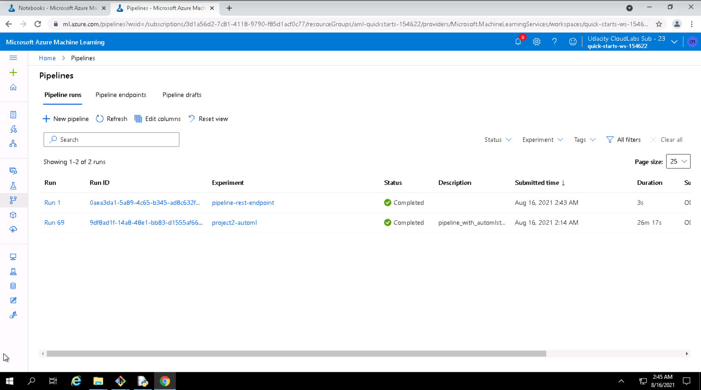
#### Figure 11: List of created pipelines.
 
 
#### Figure 12: Bankmarketing dataset registered.
     
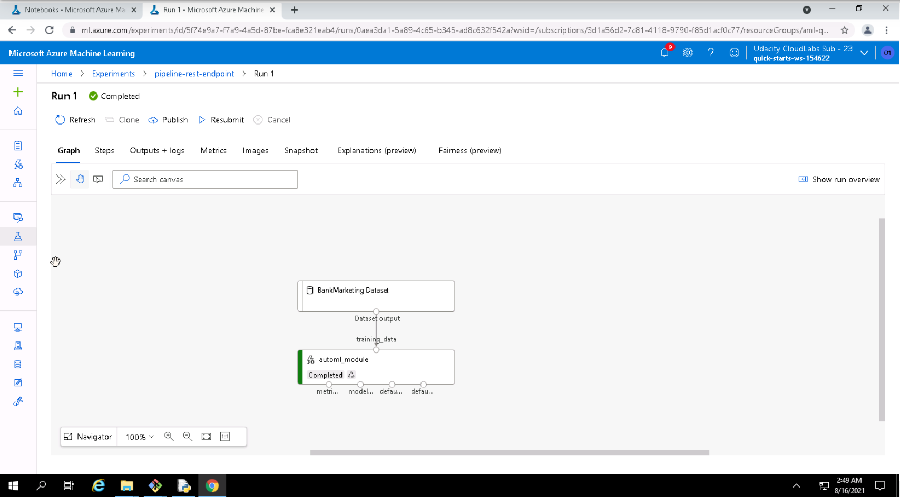
#### Figure 13: AutoML Pipeline.

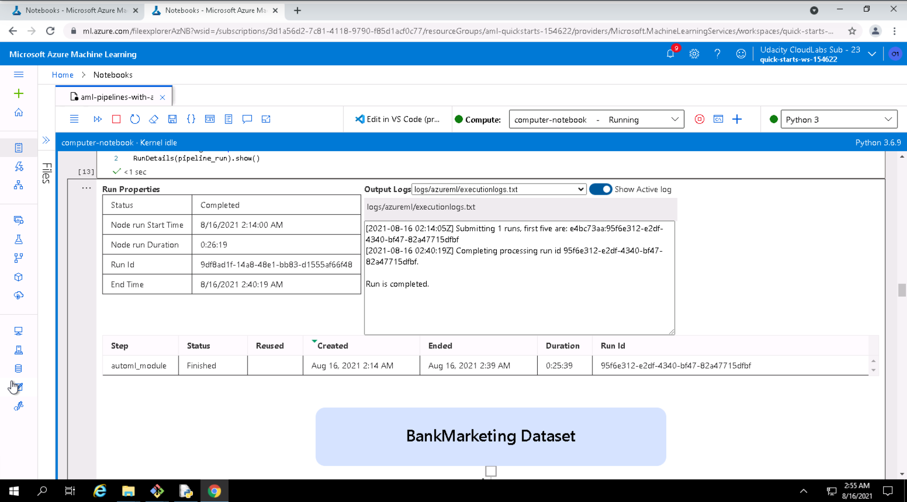
#### Figure 14: The AutoML Run is finished.
     
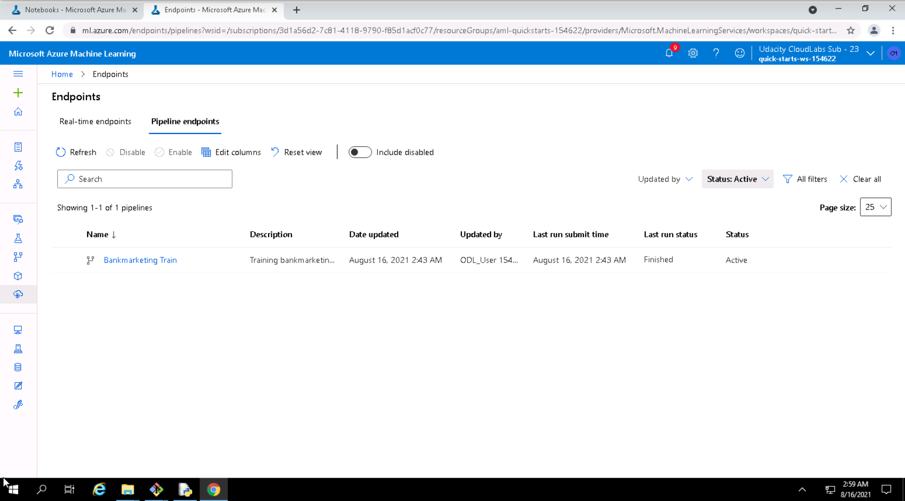
#### Figure 15: Pipeline published as endpoint.
# 4. Screencast

The screencast is cited in the next link: https://www.youtube.com/watch?v=PseGkWIaL9g
# 5. Future work

The algorithm shows that the dataset has balance issues. Therefore, is needed to add balance strategies like collecting more data, resampling the dataset, generate sintetic data, try different algorithms, penalized models among others.

