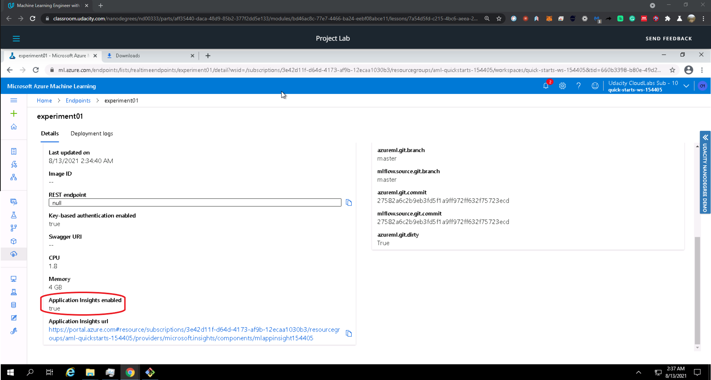

- [1. Overview of the Project](#1-overview-of-the-project)
- [2. Architectural Diagram](#2-architectural-diagram)
- [3. Procedure](#3-procedure)
  - [3.1. Authentication](#31-authentication)
  - [3.2. Automated ML Experiment](#32-automated-ml-experiment)
  - [3.3. Deploy the Best Model Model](#33-deploy-the-best-model-model)
  - [3.4. Enable logging](#34-enable-logging)
  - [3.5. Swagger Documentation](#35-swagger-documentation)
  - [3.6. Consume Model Endpoint](#36-consume-model-endpoint)
  - [3.7. Create, Publish, and consume a Pipeline](#37-create-publish-and-consume-a-pipeline)
- [4. Screencast](#4-screencast)
- [5. Future work](#5-future-work)
# 1. Overview of the Project

This project is about generating an ML model using Azure AutoML, choosing the best model, setting an authentication step, deploying the best model, setting a logging step, consume the model deployed in an endpoint. In the following steps, an architectural diagram, and the different steps used to develop a full ML solution. 
# 2. Architectural Diagram

Next figure shows the arhitectural diagram used by the deployed solution:

The architectural diagram starts with the authentication, and this is a crucial step to allows uninterrupted flows. When authentication is no set properly, it requires human interaction, and thus, the flow is interrupted. AutoML is Automated Machine Learning, and this is a tool that helps to focus on the business problem instead of the technical issues like feature engineering, hyperparameter selection, and training and tuning. After selecting the best model trained by the AutoML algorithm, it is time to deploy it. But, it is needed to monitor the model behavior to make sure it is working well, so the logging is enabled to do such a task. The following steps: consume model endpoints and create and publish the pipelines are the last steps by which we interact with the model by passing values and delivering the prediction.

# 3. Procedure

Below are the steps that were followed to develop this project. 

## 3.1. Authentication

For this step, it is necessary to install the az cli utility to use the az commands. The next step is to log in by using az login. Then, now the Azure Machine Learning extension is installed with az extension add -n ml -y. After successfully installing the Azure Machine Learning extension, the Service Principal (SP) is created and allowed to access the Azure Machine Learning workspace as shown in the next figure.

The command az ml workspace share is executed as follows:

## 3.2. Automated ML Experiment
After the security is enabled and authentication is completed, an experiment using Automated ML is done. The next figure shows the Bankmarketing dataset uploaded and ready to use.

The next figure shows the finished AutoML experiment.

The next figure shows the best model.

     

## 3.3. Deploy the Best Model Model

When the experiments are finished, the best model selected, the model is deployed over an endpoint.

## 3.4. Enable logging
The Application Insights is enabled during the logging to get more info. The Application Insights is activated by code. The following pictures show the Applications Insights activated and the logs delivered during its execution.

## 3.5. Swagger Documentation

As part of the exercises, the model is consumed using swagger. For this step, Azure provides a Swagger JSON file, which points to the deployed models. Next figure shows swagger running on localhost showing the HTTP API methods and responses for the model.

## 3.6. Consume Model Endpoint
A script named endpoint.py is used to interact with the trained model. Next figure shows the endpoint.py file running against the API producing a JSON output from the model.

## 3.7. Create, Publish, and consume a Pipeline

For this step, the jupyter notebook aml-pipelines-with-automated-machine-learning-step.ipynb was uploaded. The variables inside the jupyter notebook were updated, the config.json file was downloaded and available in the current working directory. All the cells were run. The following figures document the evidence.

 
 
     

     

# 4. Screencast

The screencast is cited in the next link: https://www.youtube.com/watch?v=PseGkWIaL9g
# 5. Future work

The algorithm shows that the dataset has balance issues. Therefore, is needed to add balance strategies like collecting more data, resampling the dataset, generate sintetic data, try different algorithms, penalized models among others.

